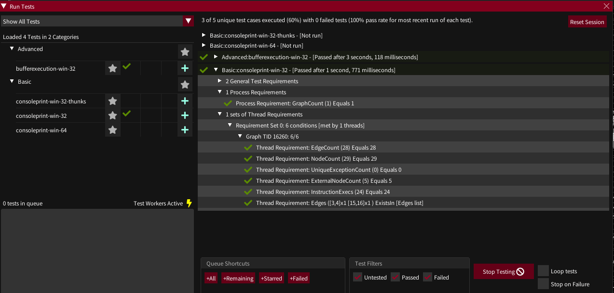

# Testing

Having a big suite of tests is be essential to verify that the traces gathered are (and remain) correct enough. rgat is in the awkward stage of its development where a lot of time and effort spent on creating a built-in test harness but not actually having many tests to run yet. This is because the command-line-tracing mode isn't implemented yet, which could allow tests to be integrated into the CI process.

### The test harness



The path to a tests directory (containing test.json test cases and test binaries compiled by building the main rgat solution) should be configured in Settings->Files.

Clicking 'Reset Session' will reload all tests and clear any results.

The plus symbol next to each test will add it to the Queue. 
Click 'Start Testing' to have workers start executing tests in the queue. 
Tests can be looped 

### Tests

Here is an example test case:

```
{
	"Meta": 
	{
		"BinaryName": "BufferExecution32.exe",
		"Bits": 32,
		"OS": "Win",
		"Comment": "Tests rgat's ability to dip in and out of instrumented code within a non-image buffer",
		"Category": "Advanced"		
	},
	"Configuration":{
		"HideAPIThunks": true,
		"DiscardTraceData": true
	},
	"FinalRequirements":{
		"Test":{ 
			"TotalGraphs": { "Value": 1, "Condition": "Eq", "Comment": "Sometimes get a second thread here?" },
			"TotalProcesses": { "Value": 1, "Condition": "Eq" }
		},
		"Process":{
			"ProcessRequirements": { 
			   "GraphCount":{"Value": 1, "Condition": "Eq"}
			},
			"ThreadRequirements": [
				{
				   "EdgeCount": { "Value": 34, "Condition": "Eq" },
				   "NodeCount": { "Value": 34, "Condition": "Eq" },
				   "UniqueExceptionCount": { "Value": 0, "Condition": "Eq" } ,
				   "ExternalNodeCount": { "Value": 4, "Condition": "Eq", "Comment": "VAlloc, VFree, ExitProcess in the image, GetStdHandle in the buffer"} ,
				   "InstructionExecs": { "Value": 50, "Condition": "Eq", "Comment": "34 nodes minus 4 API calls + 20 extras from the REP MOVSB" },
				}
			]
			
		}
	}
}
```

| Field  | Meaning  |
|---|---|
|  Meta | Describe the binary and environment the test targets |
|  Configuration | Trace settings the test results apply to |
|  FinalRequirements | The expected state of any gathered traces |

FinalRequirements is broken down into "Test" requirements that apply to all gathered processes, "Process" which applies to the first trace and "Children" which apply to child processes.

Most objects can have a "Comment" property which may be ignored or displayed.

### Compiling Test Binaries wit Visual Studio

Build dependencies -> masm
Right c;ick the .asm file, set Content = yes, Item Type = Microsoft Macro Assembler
turn off *safeseh* (Configuration Properties -> Linker -> Advanced -> Image Has Safe Exception Handlers)
General->Output Directory -> $(SolutionDir)\tests\Output\{OS}}\{Category}\{Test name}\
General->Output Directory -> $(SolutionDir)\tests\Output\win\basic\ConsolePrint\
Set json test specs to Content: Yes, and Item Type: Copy File