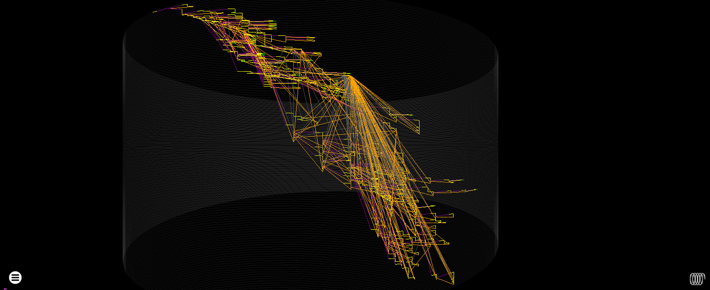
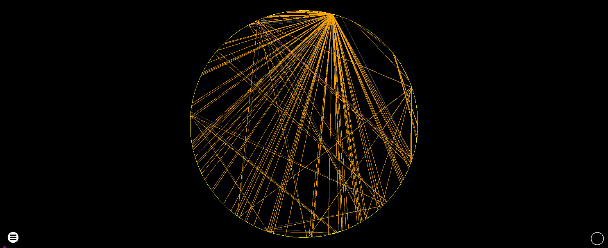
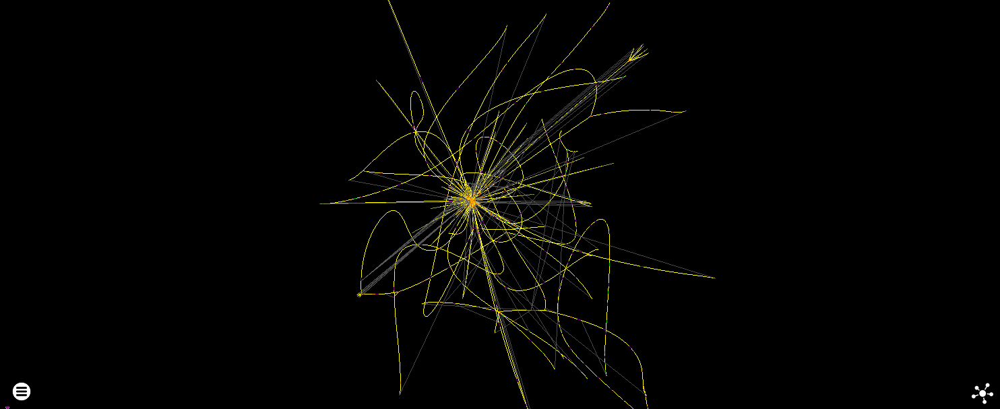
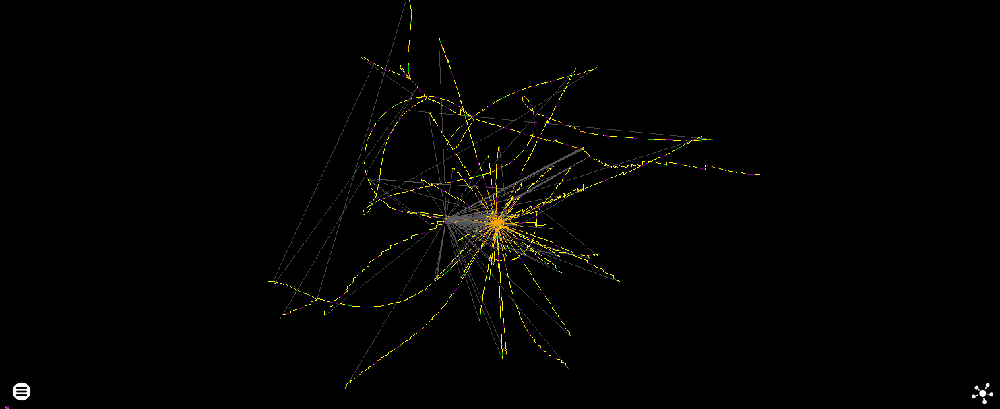
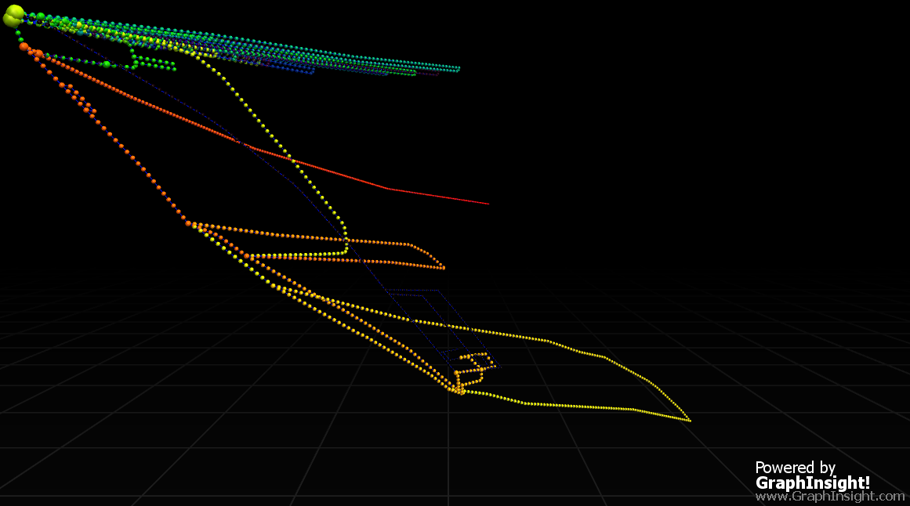
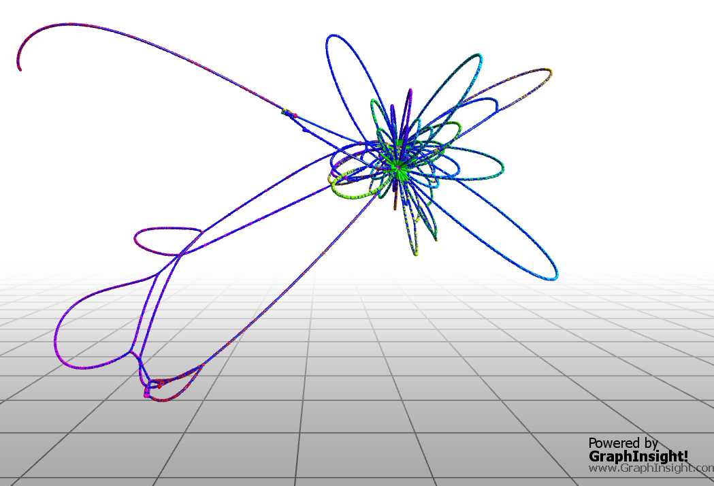

# Visualisation

While running programs with high performance instrumentation presents a lot of opportunities for other types of analysis (and I'm eagerly awaiting the time when existing features are 'done' enough to be able to work on things like memory/data analysis) creating useful visualisations is very much rgat's reason for being, and it probably isn't much use if it can't do that. It won't be a proper release until the user can easily get a layout which provides enough insight into the structure of the program to make the time worth it.

Unfortunately laying out very large graphs in a single plot in a useful way is a difficult problem.

Currently each thread is plot on a separate graph, though in the future it would be good to draw these graphs in the same view so we can visualise thread interactions.

Two categories of layout are supported:

### Static Layouts

These are high performance plots which generally place each instruction according to he control flow performed by the parent instruction, with no regard for the wider state of the graph.

* Cylinder

A trusty faithful from rgat's early prototype days, this plots a relatively standard control flow graph in 3D by placing instruction nodes on the edge of a winding cylinder.


*The radius of the cylinder can be expanded to mimic a flat layout. It's more resilient to node-clumping issues but can still get overwhelmed by return from a stack check. Reducing the alpha of return edges can help here.*

* Circle 

This was only implemented because it was super quick to do, and looks kinda cool. Probably not very useful aside from making it very obvious where the most connected nodes are.



* Sphere [removed]

Documented for completeness but not part of the rgat rewrite, this was the first type of plot that was created. The squashing of edges near the poles meant that it didn't scale very well and was superseded by the cylinder layout which could be extended trivially without having to change the location of previous geometry. 

### Force Directed Layouts

Force directed graph layout involves applying forces to the nodes of a graph and letting Physics take the wheel to produce something that may or may not look nice. Unfortunately physics has no interest in improving our understanding of obfuscated code, so rgat has become as much a graph drawing research project as it is a program analysis one.

* Fruchterman–Reingold - Nodes

This is a Vulkan reimplmentation of [Jaren McQueen's WebGL demo](https://github.com/jaredmcqueen/analytics)
It's a straightforward, 'repel every node from every other node, then attract every connected node', `O(n^2)` complexity algorithm which makes use of a GPU absolutely essential. I can get to about 100,000 nodes on an RX580 before things get very choppy and 200k+ starts to make the driver die. The instability could probably be fixed but i'm not so sure about the performance or layout quality.


*Aside from performance issues, node clumping harms the usefulness of this scheme - though arguably this will apply to any force directed layout'

* Fruchterman–Reingold - Blocks

Like the nodes algorithm, but it operates on basic blocks instead so has the potential to perform reasonably on much bigger graphs. It's also a (little) bit clearer as block instructions are drawn together rather than as ridiculous winding strings.



*The overall layout is similar to nodes, but at a fraction of the cost and more useful when zoomed in to invividual instructions*

The results are not great right now - some configurable variables are available to tweak the forces applied but different algorithms need to be given a chance.

[This paper](https://jgaa.info/accepted/2007/HachulJuenger2007.11.2.pdf) describes some of them

Promising options to look at are:

* [FM3](http://e-archive.informatik.uni-koeln.de/472/2/zaik2004-472.pdf)
  - 'This algorithm also uses a multi-scale method. It first partitions all nodes into a “galaxy representation”. Each node is marked as either a sun, planet or moon. Then each “solar system” is collapsed into a single node. This process is repeated until a stopping condition is met.'

* [GRIP](https://www2.cs.arizona.edu/~kobourov/grip_paper.pdf)
    ```
    create a filtration V : V0 ⊃ V1 ⊃ ... ⊃ Vk ⊃ ∅
    set up scheduling function nbrs()
    for i = k to 0 do
        for each v ∈ Vi − Vi+1 do
            find vertex neighborhood Ni(v), Ni−1(v),...,N0(v)
            find initial position pos[v] of v
        repeat rounds times
            for each v ∈ Vi do
                compute local temperature heat[v]
                disp[v] ← heat[v] ·−→FNi (v)
            for each v ∈ Vi do
                pos[v] ← pos[v] + disp[v]
    add all edges e ∈ E
    ```
* [High-Dimensional Embedding](https://www.wisdom.weizmann.ac.il/~harel/papers/ms_jgaa.pdf)
    - 'The method HDE of Harel and Koren is based on a two phase approach that, first, generates an embedding of the graph in a very high-dimensional vector space and, then, projects this drawing into the plane.'


A HDE rendering of the above graphs. The detail of the 4000~ nodes/edges 

I've also seen some good versions of Fruchterman Reihngold optimised with Barnes-Hut, but the algorithm looked awful to implement. The ideal algorithm will work well on a GPU.


*Fruchterman-Reingold Proportional Multi-level layout of the above graphs*

Different layouts can be tested using the "Export Pajek" function and loading the result in a program such as [GraphInsight](https://github.com/CarloNicolini/GraphInsight). 

### Graph re-writing

It's possible that removing problematic regions from the graphs will be more useful than just throwing different layout algorithms at the problem. One example of this with with API thunk hiding, where instructions that call library functions have a library node placed next to them, rather than all having an edge to a single thunk that jumps to that API.


## Shaders

rgat has 4 categories of shader, mirroring Jared's demo:

* Velocity (Compute) - Calculates forces between nodes to set their velocity
* Position (Compute) - Changes the position of each node based on their velocity
* Attribute (Compute) - Performs animation operations in reponse to replay or user interaction events.
* Rendering (Vertex/Fragment) - Combines the results of the control-flow based geometry colours (call => purple, jump => red, etc), the Position shader output and the attribute shader output to draw an interactive graph
