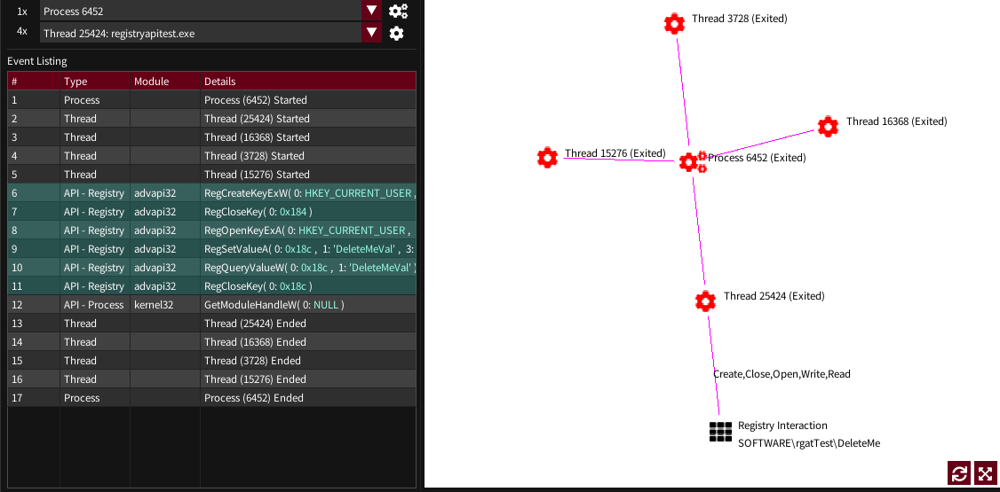

## Analysis Tab

In rgat 0.6.0 this is still at a prototype stage - very few APIs are supported. See [Development->Instrumentation](/devdocs/instrumentation) for more details.

The analysis tab has a table of API usage information for collected traces and a chart to display thread, process and supported API interactions.

