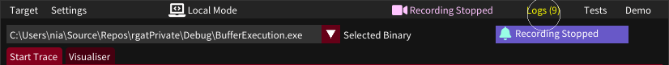
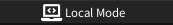
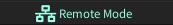
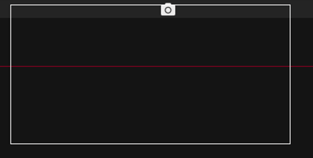
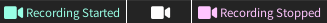
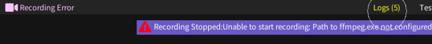
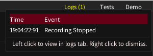
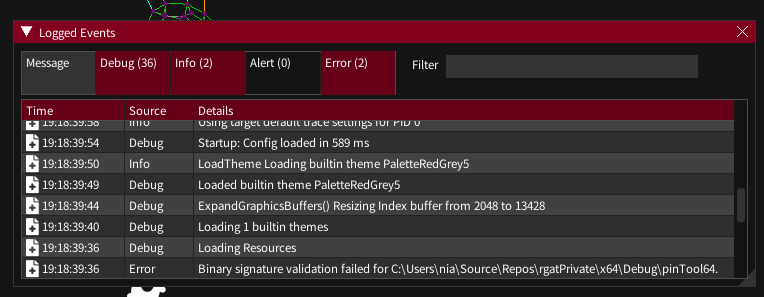

### Menu - Top Row

- [Menu - Top Row](#menu---top-row)
- [Target Bar (Middle row)](#target-bar-middle-row)
- [Tabs (Base Row)](#tabs-base-row)

The top row contains standard menu actions

* **Target**
    - **Select Target Executable** - Open a file dialog to choose a new binary target to load
    - **Recent Binaries** - Choose from a list of recent loaded targets   
    - **Open Saved Trace** -  Open a file dialog to choose a previously loaded binary target to load
    - **Recent Traces**  - Choose from a list of recent saved/opened traces   
    - **Save Trace** - Save the active *trace* (ie: all the graphs of the process being viewed in the visualiser) to the traces directory
    - **Save Target** - Save all the generated traces of the active *target* (selected in the target bar)
    - **Save All** - Save all of the generated traces for all loaded targets
    - **Export Pajek** - Save the active graph (the one in the main visualiser window) in Pajek format. This can be loaded into other graph visualisation tools.
    - **Open Screenshot/Video Folder** - Open a file manager window to the screenshot/video capture directory
    - **Exit** - Close rgat

* **Settings** - Opens the [Settings Dialog](ui-settingsdialog)

* **Remote Tracing** - Shows the state of the connection and opens the [Remote Tracing](remote-tracing) dialog when clicked.

 
 *Targets will be executed on the current machine*

 
 *Targets will be executed remotely*

* **Screenshot Icon**

When the image capture keybind is activated (Maingraph, Maingraph+Previews or Whole UI) an animated bounding box showing the area captured will collapse to this icon as feedback. The icon will linger for a few seconds and can be clicked to open the folder the image was saved to.

* **Recording State**

A video icon will show while recording the rgat window via FFmpeg. This icon can be left clicked to open the media directory and right clicked to stop recording.

* **Logs**
The Logs menu entry is where all of rgat's alerts, errors, logs and debug output is accessed. Unread alerts and errors are shown as a counter and can be previewed by mousing over the entry.

*An error causes an alert box under the log menu entry and an animation to draw the eye*

*Mousing over the logs icon with one unread alert*

Right clicking will clear the alerts.
Left clicking will open the Logs dialog.

    
*The filterable logs dialog accessed from the logs menu item*

* **Tests** - Access to the [test harness](/devdocs/testing). Must be enabled in Settings->Miscellaneous

* **Demo** - Access to the ImGui demo dialog, which may be useful for UI testing and development. Must be enabled in Settings->Miscellaneous. In future this may be unavailable in release builds.

### Target Bar (Middle row)

The targets dropdown can be used to set switch between loaded target binaries to set the active target.

Not available on the splash screen

### Tabs (Base Row)

Select the workspace

* Start Trace - Configure/Launch the active target
* Visualiser - View running/collected traces
* Analysis - View API information for gathered traces

Not available on the splash screen