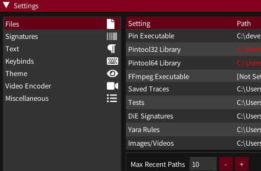
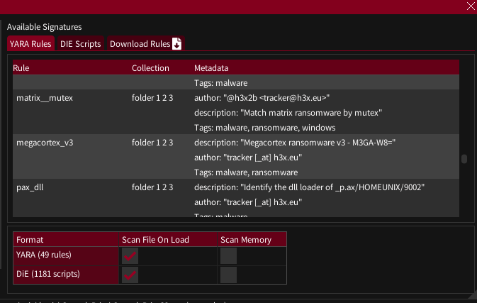
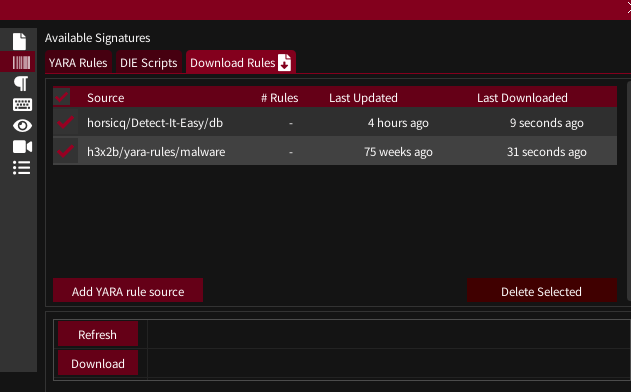
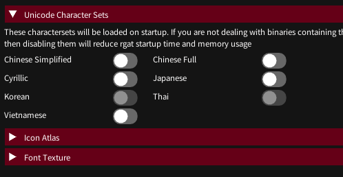
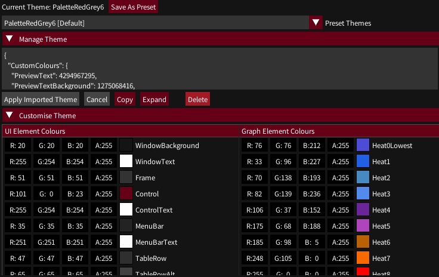
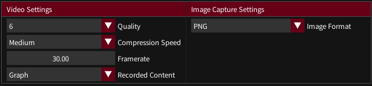
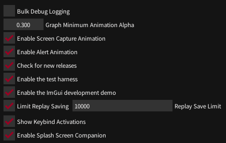

## Settings Dialog

- [Settings Dialog](#settings-dialog)
    - [Files](#files)
    - [Signatures](#signatures)
    - [Text](#text)
    - [Keybinds](#keybinds)
    - [Theme](#theme)
    - [Video Encoder](#video-encoder)
    - [Miscellaneous](#miscellaneous)

This is accessible from the menu bar

#### Files 

This paths to files and settings rgat needs are configured here. Most should be automatically set on first launch.

#### Signatures 

rgat supports Yara and has some support for Detect-it-Easy signatures

Currently these are used to scan files on load, or manually. When memory operations are implemented these will also be used to scan memory.

rgat has a signature downloader which is designed around Github repos. You can configure a list of repos (base or subdirectory) and use 'Refresh' to check for new updates or 'Download' to pull them to your signatures directory.

[The InQuest awesome-yara page](https://github.com/InQuest/awesome-yara) has a large list of repositories.

#### Text

This is mainly for development - the only settings of interest are the ability to toggle unicode glyphs.

The raw-graphics nature of the UI means fonts must be built on launch, which slows startup down, so you may not want to enable large character sets unless your target binaries (or their APIs) are using them. 

#### Keybinds

Graph navigation is quite keyboard-heavy, so keybinds are configurable here

#### Theme

UI and graph colours can be customised here and saved as themes, which can be imported and exported.

#### Video Encoder

These settings will be used for video recording using FFmpeg

#### Miscellaneous

Settings without their own category