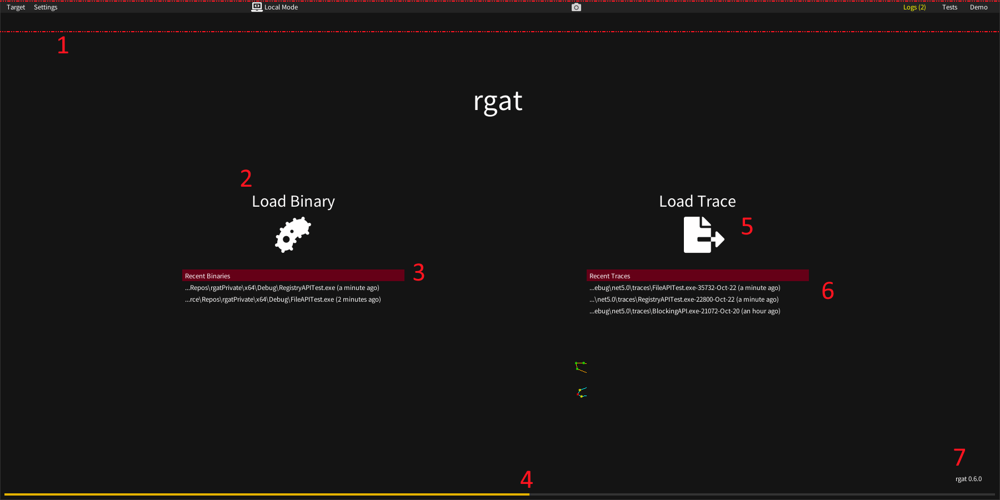

## Splash Screen

The initial view acts as a loading screen while config parsing, font building, loading signatures, etc is performed in the background. 

1. The [Menu Bar](ui-menubar.md) appears when the mouse cursor is in the top third of the screen.
2. Load a new binary target. This will do some initial static analysis to prepare it for tracing but won't execute it yet.
3. A list of recently loaded targets for quick access.
4. The startup progress bar, while rgat is initialising. Some activities may be restricted before this is complete.
5. Load a previously saved trace.
6. A list of recently saved/loaded traces for quick access.
7. The current rgat version. If an update is available then an option will be available here to view the changelog and download the new version.