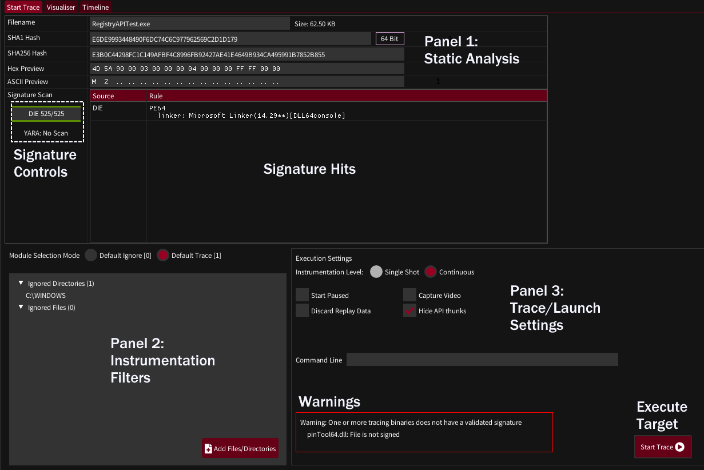
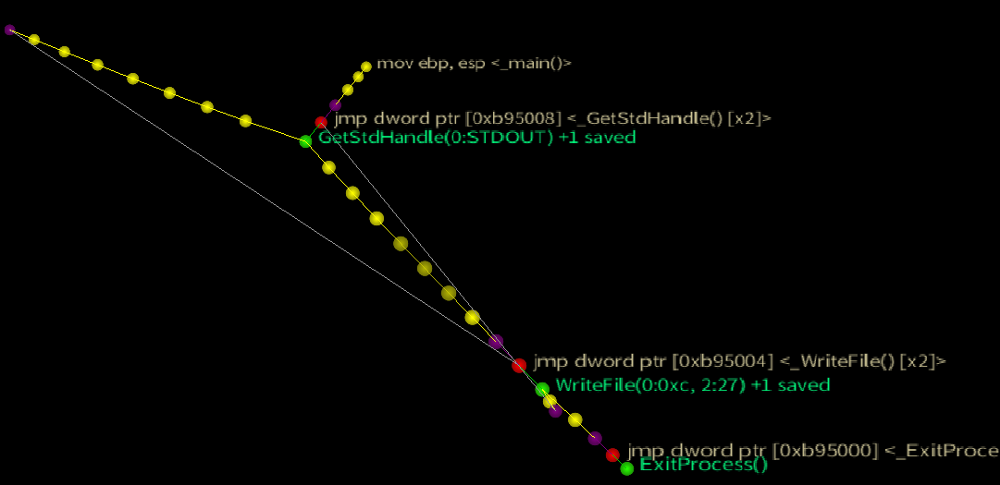
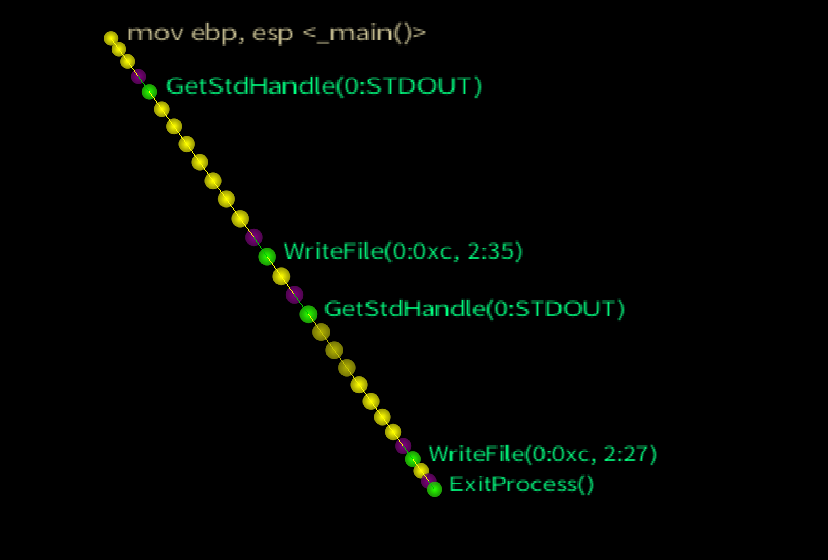

## Trace Launch Tab

- [Trace Launch Tab](#trace-launch-tab)
    - [Panel 1: Static Analysis](#panel-1-static-analysis)
    - [Panel 2: Instrumentation Filters](#panel-2-instrumentation-filters)
    - [Panel 3: Execution Settings](#panel-3-execution-settings)

The trace launch tab is the landing area for a newly loaded binary. It provides some lightweight information about the binary and provides configuration to the next stages of tracing.

#### Panel 1: Static Analysis

The top fields should be self explanatory. The Hex and ASCII previews can be moused over and scrolled with the mousewheel.

If Yara and/or Detect-It-Easy signatures are configured (Settings->Signatures) then newly loaded binaries will be scanned, with signature hits appearing in the hits pane.
The signature control bars show the progress of scanning and can be left clicked to re-scan. Right clicking will reload the signature database and rescan - which may be useful if you are tweaking signatures.

#### Panel 2: Instrumentation Filters

To generate practical graphs it's important to try and restrict instrumentation to code we are interested in. rgat can operate in two modes:

* Default Ignore - Only trace code in specified binaries/libraries
* Default Trace - Trace everything that is not specifically ignored

By default rgat operates in Default Trace mode, with everything in the Windows directory ignored to avoid tracing ntdll, kernel32, etc. 

Tailoring the filters is likely to be essential to the tracing of large applications with many libraries.

In future this will support more focused options such as address ranges or types of memory.

#### Panel 3: Execution Settings

* Instrumentation Level - This can be ignored at the time of writing. Different levels of instrumentation will be available in the future.

* Start Paused - The first thread will start paused. Pressing 'Continue' in the visualiser tab will begin execution. 

* Discard Replay Data - For large, long running traces it may be useful to discard trace data after it is visualised. This reduces the memory burden and saving times but makes replay unavailable.

* Capture Video - Start recording as soon as the trace begins being visualised. Requires FFmpeg to be configured.

* Hide API Thunks - Re-write the control flow graph at runtime to give each API call its own node instead of linking each caller of an API to a single jump thunk. This makes graphs much more useful, but may introduce errors. Disable to see the 'true' structure of the code. 

    *Option Disabled: The actual control flow of the ConsolePrint32 testcase (force directed node)*

    
*Option Enabled: The same test case with API thunks hidden reflects the flat control flow of the actual code*

* Command Line - specify command line arguments to pass to the traced target

* Warning Box - any warnings to be aware of before running the target

* Start Trace Button - causes the target to be executed. rgat will switch to the visualiser pane when the tracer connection is established.