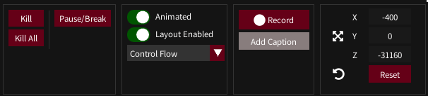
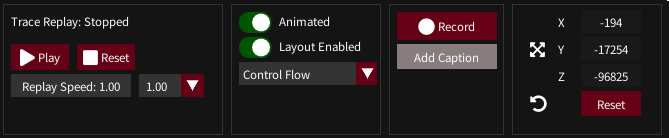

## Visualiser Tab

*This describes the elements of the visualiser UI, see [Manipulating Graphs](graph-manipulation) for a guide on how to use it*

- [Visualiser Tab](#visualiser-tab)
  - [Main Visualiser Pane](#main-visualiser-pane)
    - [Quick Menu](#quick-menu)
  - [Preview Pane](#preview-pane)
  - [Visualiser Bar](#visualiser-bar)
    - [Visualiser Bar: Live Thread](#visualiser-bar-live-thread)
    - [Visualiser Bar: Replay](#visualiser-bar-replay)
  - [Controls](#controls)
  - [Trace Selector](#trace-selector)

This tab has 5 sections

1. Main Visualiser Pane - View and manipulate the active thread graph
2. Preview Pane - Graph state information, selection and navigation
3. Visualiser Bar - Experimental short term trace information, doubles as a replay slider
4. Controls - Various actions and information displays for the current thread graph
5. Trace Selector - Choose different threads/traces for the active target

### Main Visualiser Pane

This displays the currently selected thread graph. 

It also has event messages in the top corners

Keybind activation messages will appear in the top left corner (This can be disabled in Settings->Miscellaneous->Show Keybind Activations).

Certain thread, process, and API events will be displayed in the top right.

The bottom right has a layout selector to change the layout of the active graph

*The icon showing the active layout style*

*This can be moused-over to select a different layout*

The bottom left of the pane has a mouseover menu (called the Quick Menu) with controls for changing how the graph is displayed and manipulating the layout.

#### Quick Menu

Mousing over the quick menu icon (or using the quickmenu keybind) will bring up further menu icons (red box, above) which can be mouseover. Each also has their own keybind which is active when the menu is active.

Futher information is available in the rgat mouseover dialogs.

Ordered from top to bottom:

*The Graph Layout Menu [Force Directed]*

- This has controls specific to the type of graph layout that is currently active - the options above are for force directed layouts
- The top buttons redistribute the nodes in different ways which may yield more useful final layouts.
- The computation toggles control what processing is passed to the GPU or paused.
- Sliders can be used to control how much energy nodes have, how fast they can move or apply other more experimental force modifiers.
- The checkbox by the temperature slider will maintain the graph at the same temperature (energy level).

* Highlighting

*The highlighting menu [Symbols Tab]*

* Thread graphs can be very busy, so the highlight functionality helps with locating API calls, addresses and exceptions.
* Mouseover a symbol to highlight all of them on the graph, or click a symbol to keep it highlighted.
* Click the symbols to un-highlight or the clear button at the bottom to remove all highlights.
* There is a popout button to make this frame a standalone dialog, but this is the only remaining known source of (hard to reproduce, release-mode only, may have gone away?) crashes, so maybe avoid using this.

* Visibility

*The Visibility Menu*

* This tab has many toggles for different bits of graph geometry and text
* It also allows changing the scale of node labels

### Preview Pane

*A preview graph, zoomed and annotated*

The preview pane is a small but feature-rich visualiser pane has two main roles:
* The list provides an overview of the state of each instrumented thread, with the ability to sort and select the graph to view in the main visualiser
* Each individual preview is an important aid to avoid getting 'lost' in the current view. 

Features include:
* The Thread ID of the graph in the top left
* A caption and border showing which thread is active
* The background colour shows the state of the thread (running, terminated, suspended)
* The top right plots trace activity to highlight which parts of the process are busy
* A box shows where the camera is currently zoomed into
* It can be left-clicked and dragged to move the camera
* Moused over to show statistics
* Right clicked to change how the list is sorted

### Visualiser Bar

The visibility bar is an experimental attempt to add a bit more context to what is happening a trace beyond what we can see in the visualiser pane. 

It has two modes: Live and Replay

#### Visualiser Bar: Live Thread

The live bar is shown when an active process is being traced. It renders the last 100 trace items received. In most situations this will be scrolling too fast to read - the idea is to display useful patterns that can be picked up in repeating areas of code or when the thread is blocking.

The live bar has 3 sections.

Top: Blocks Trace Tags

This shows an approximate size of the recent basic blocks and how they have been traced. 

*Blocks 580, 581, 582, 583 and 584. Block 580 was partially deinstrumented as it looped over 40 times - represented by the red and green bounding rectangle*

Currently different blocks vary only in how their size (in instructions) is represented, but in future each block will get a semi-unique pattern and/or colour combination to distinguish it.

Middle: Heatmap

The middle segment shows the heatmap of this area. It also has a plot of the tag instruction count compared to the average for the area - in the above showing that most of the activity is in the 'busy' areas.

Base: Modules

The base of the bar shows higher level module location information. If instrumentation spans multiple modules then the name of the active module is printed. Green entries are uninstrumented API calls with symbols. Red entries are entires into uninstrumented code without a symbol.

#### Visualiser Bar: Replay

The replay bar is mainly used to show the progress of playback, and can be clicked to move to a different area of the replay. It also shows similar information to the live bar, calculated over all the saved data.

The top section has a cumulative instruction count line (red) which shows how work is distributed over the thread. The gold line shows trace entries with higher than average instruction counts. 

The middle section is a heatmap. 

The base section shows the distribution of code across instrumented modules.

If the bar is missing, or partially greyed out, then trace replay data has been discarded. 

### Controls

Below the visualiser bar, the controls also have slightly different live and replay variants

*Live trace controls with pseudo-debug actions*

The pause/step functionality does not use debug APIs, but is not reliable yet.

*Replay controls*

From left to right these panels are:

* Trace Replay
* Shader control - Disable animation for full brightness. Disable layout to pause layout computation
* Video capture control, alternative to the keybind. Requires FFmpeg
* Camera controls - Camera location can be set here by typing or dragging if the keybinds are not suitable. Reset resets the plot rotation.

### Trace Selector

Below the preview pane, the trace selector allows switching to different traces or threads.
It shows statistics for the active graph (left) and performance information (right).

* Queue - The number of trace items awaiting placement on the graph
* Queue (+) - The number of trace items received recently
* Queue (-) - The number of trace items processed recently
+ RepQu - The number of items in the repeat queue. Mainly for debugging.
* Layout - How long it is taking the GPU to perform a layout step

The right pane can also be clicked for more performance information:

